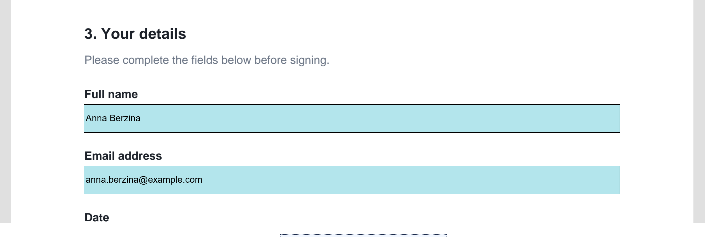

# Reading the document and filling in its fields

## Reading it

The document fills most of the screen. Scroll up and down with a finger, the way
you would on any web page. Take as long as you like — nothing is sent while you
read.

The zoom level is fixed on purpose: keeping the document at one size means the layout is
stable and the signature always lands where the document expects it. So pinch-to-zoom does
not usually work, and that is by design rather than a fault. If the text is too small to read
comfortably, say so rather than signing something you cannot read — staff can help, and the
document size itself is something the organisation can adjust.

## Filling in fields

Not every document has fields. Many are read-and-sign only. If yours does have
them, they appear as highlighted boxes in the page.

PadSign is form-agnostic: it works with whatever fillable fields the document contains,
with no special preparation per form. Whatever your organisation's template asks for is
what appears — PadSign neither adds questions nor needs to be told about them in advance.

1. **Tap the field.** The device's on-screen keyboard appears.
2. **Type your answer.** Normal text entry.
3. **Tap the next field**, or tap outside to close the keyboard.

Tick boxes and choice fields work by tapping directly on them.

## What counts as required

That depends entirely on the document, which comes from the organisation's own
templates. PadSign displays and checks what the document asks for; it does not
decide the questions.

## If you miss something

You will not silently submit an incomplete form. If a required field is empty when
you tap **Sign**, nothing is sent — a message appears listing what is still needed,
and it stays on screen until you dismiss it. Fill in what it names and tap Sign
again.

The same applies to the signature itself: an empty signature box counts as missing
and will stop the submission.

## Will my typing be saved?

Yes. What you type into the fields becomes part of the signed document, so it is
preserved exactly as you entered it. This is also why the information does not need
re-typing by staff later — it is already data.

## One thing to check before signing

Read what you have entered back before you tap Sign, particularly contact details.
Correcting a typo now takes a second; correcting it after the document is signed
and delivered means the document has to be redone.
