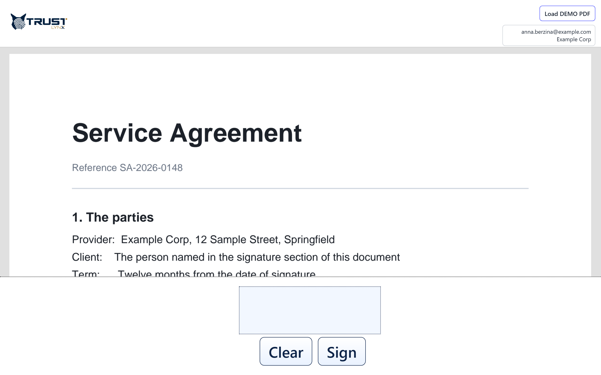

# The portal — what runs on the tablet

The portal is the part the signer sees. It is a web application, so it runs in the
device's own browser.

## Nothing is installed on the device

There is no native tablet app to deploy, update, or manage across a fleet of devices.
The tablet opens a web address and that is the whole setup. Practical consequences:

- Any reasonably modern tablet, phone or touchscreen PC can be a pad.
- Replacing a broken device means pointing a new one at the same address.
- Updating PadSign does not require touching the devices.

## What it does

**Renders the PDF.** A PDF viewer component displays the document with its interactive
form fields live, so the signer can complete them on screen. Text selection is disabled
so that dragging a finger scrolls the document rather than highlighting text.

**Captures the signature.** The drawing area records the stroke the signer makes with a
finger or stylus and turns it into an image for placing in the document.

**Fetches the document securely.** The portal downloads the PDF itself, authenticated
with the device's session, rather than letting the viewer request it anonymously. That is
what allows the document route to be locked down.

**Shows progress and outcome.** The step-by-step panel during signing, and the success or
failure result.

**Polls for work.** It checks for a document waiting for this pad every few seconds, which
is why a document appears on its own.

## Settings are loaded, not baked in

The portal reads its configuration at runtime when it starts, rather than having settings
compiled into it. This is why branding, wording, language defaults and feature toggles can
be changed for a deployment without a new build.

## It needs a network connection

The portal is served from your PadSign environment and talks to it continuously — to poll
for documents, to fetch the PDF, and to run the signing steps. It is not an offline
application. If the device loses its connection, it shows a clear message and retries
automatically rather than failing silently.
