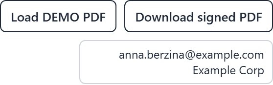

# What is demo mode?

Demo mode exists to answer "can we see this working?" without first building an
integration.

Normally a document reaches the pad because one of your systems sent it. That means seeing
PadSign work requires connecting it to something. Demo mode removes that requirement: you
pick a PDF from the device itself, and the full signing flow runs on it.

## What it adds

**A "Load DEMO PDF" button.** Opens a file picker so you can choose any PDF on the device.
It uploads, and the document appears on the pad exactly as if a system had sent it.

**A "Download signed PDF" button**, which appears after signing so you can save the finished
file and inspect it — including opening it in a PDF reader to look at the signature.

**The signed-in account on display**, so you can see which account and organisation the pad
is using.

**No automatic reset.** In normal use the pad clears itself a few seconds after signing. In
demo mode the document stays so you can download it and look at what was produced.

## What it does not change

The signing itself is real. The form fields are filled in properly, the visual signature is
placed into the page, the seal is applied if the deployment is configured for it, and the
output is a genuine signed PDF. Demo mode changes how a document *arrives* and what you can
do with it afterwards, not how signing works.

That is what makes it useful for evaluation — what you see is what you would get.

## Limits worth knowing

- There is a **maximum upload size, 10 MB by default**, so a very large PDF may be refused —
  try a smaller one. This limit is specific to demo-mode uploads and says nothing about
  production documents.
- **Older XFA-style form PDFs are not reliably supported.** If you upload one you get a
  warning saying filled fields may not be saved, and to use a standard form PDF instead. Most
  PDFs with fillable fields are the standard kind.

## It must be off in production

Demo mode is an evaluation feature and the documentation is explicit that production
deployments must have it disabled. The reason is straightforward: it lets whoever is holding
the device upload arbitrary documents and download signed files. That is exactly what you
want while assessing the product and exactly what you do not want on a tablet sitting on a
public counter.

It is one of the toggles chosen at installation and can be turned off afterwards. If you see
these buttons on a pad that is supposed to be live, flag it.
