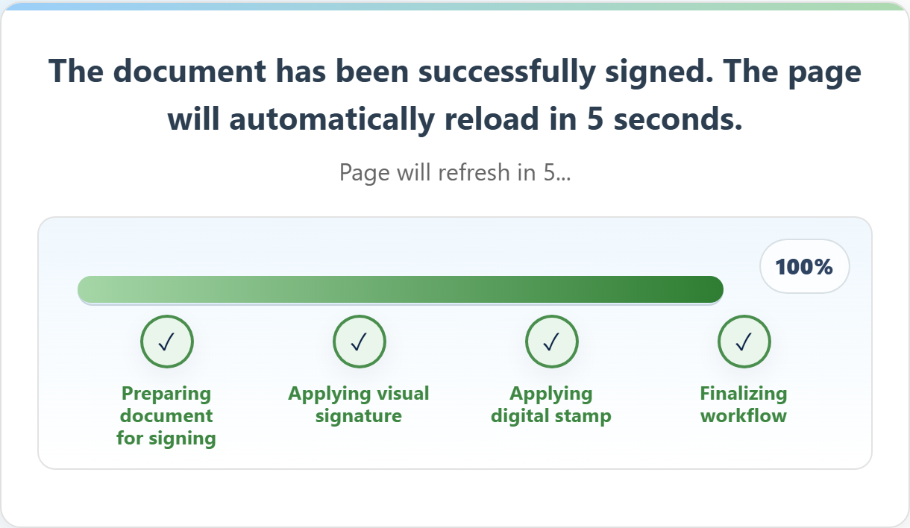

# What happens to the document after I sign it?

Everything from here is automatic. You do not save it, file it, or send it anywhere.

## The sequence

**1. Your entries are written into the document.** Whatever you typed becomes part of the
PDF.

**2. Your signature is placed into the page.** The mark you drew is added where the document
expects it.

**3. A cryptographic seal is applied**, if your organisation uses sealing. This is what makes
later changes to the file detectable.

**4. The finished document is stored** as a completed version. The earlier states are kept
too, so there is a record of the document before and after signing.

**5. It is handed onward** to wherever the organisation's setup sends it — a folder their
systems watch, back to the computer that produced it, or announced to another system so it
knows the document is ready.

**6. The pad clears itself** and returns to its resting screen for the next person.

You see steps 1 to 3 as they happen, and then a confirmation.

## The screen reset is not a problem

The countdown after "The document has been successfully signed" often worries people — it
looks like something is about to be discarded.

It is not. By the time you see that message, the document is already stored and already sent
onward. The reset only clears the display so the pad is ready for the next visitor. There is
nothing to lose and nothing you need to do before it happens.

## Will I get a copy?

That depends on the organisation, not on PadSign. The product's job is to produce the signed
document and deliver it into their systems. Whether they then email you a copy, print one, or
put it in a portal is their process.

If you want a copy, ask before you leave the counter — it is much easier for them to arrange
at that moment.

## If something goes wrong instead

If a step fails you will see a failure message rather than a confirmation, and the document
will **not** have been signed. There is no situation where a half-finished document gets
filed — each step creates a new version, so a failed step just means the final version was
never produced.
