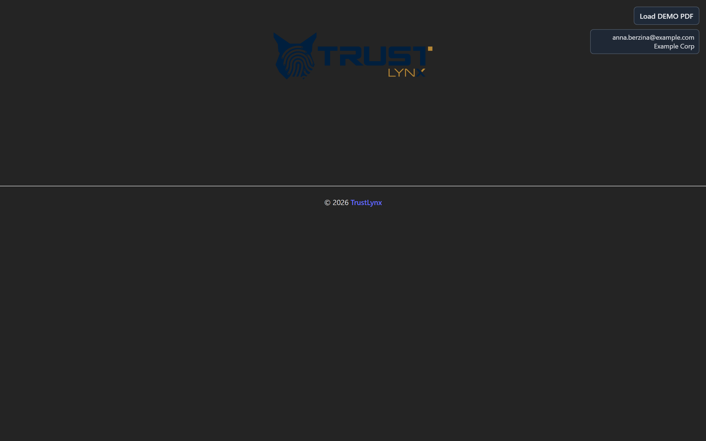
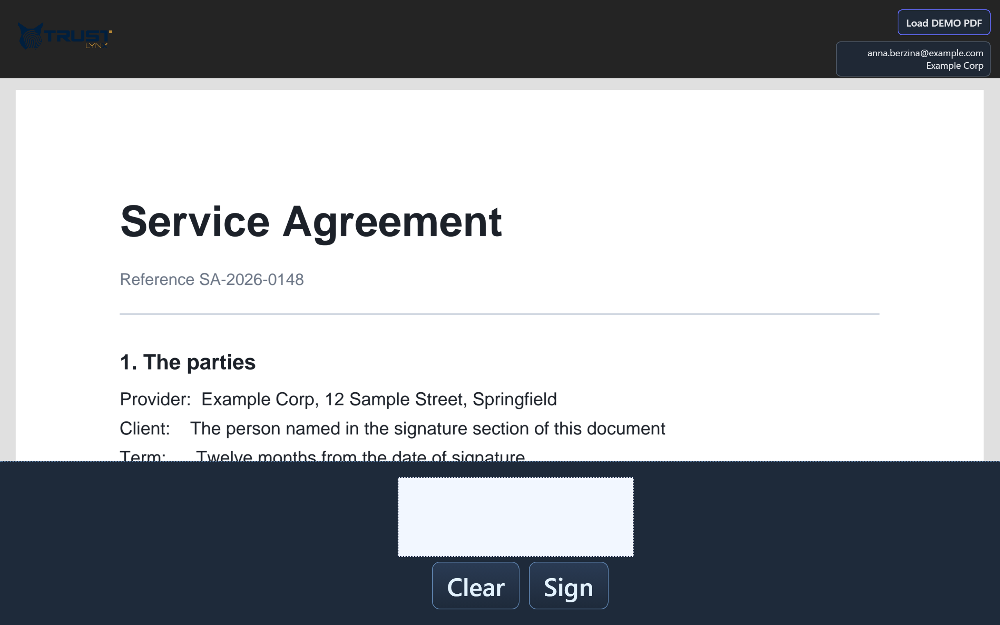
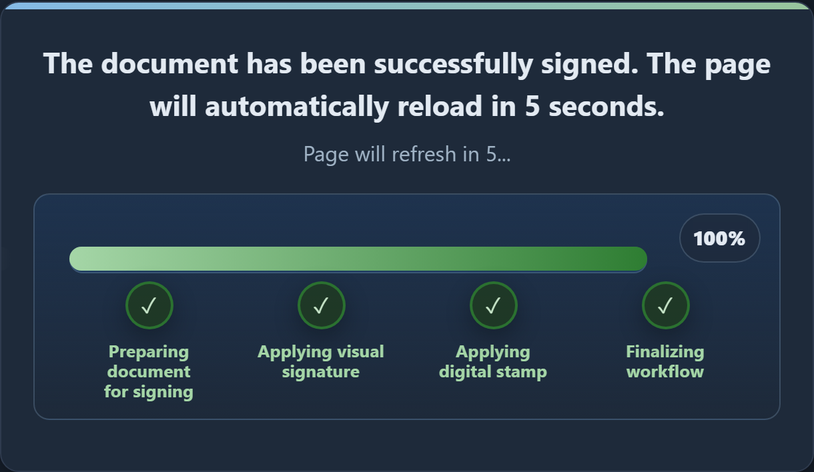

# What devices can be used, and how do people sign on them?

## Almost anything with a touchscreen and a browser

A tablet, a phone, or a PC with a touchscreen. TrustLynx describes PadSign as e-signing for
touchscreen devices and mentions phones and tablets specifically.

**There is no dedicated signature-pad hardware.** You do not buy special devices from anybody.
If you already have tablets, you can use them.

## Nothing is installed on the device

This is the practical headline. The device opens a web address — that is the entire setup.

What follows from that:

- **No app store, no deployment tooling, no per-device updates.** Updating PadSign does not
  involve touching the devices.
- **Replacing a broken tablet** means pointing a new one at the same address.
- **Mixed fleets are fine.** Different devices, different operating systems, same behaviour.

## Signing input

A **finger** works. A **stylus** works and gives a more natural-looking signature, which some
people prefer for anything that looks like a contract. Neither is required over the other, and
the device does not need to be stylus-capable.

The signature area accepts a single continuous stroke or several separate ones, so signatures
with gaps or separate initials are handled normally.

## Light and dark

The interface follows the device's own appearance setting automatically. A tablet set to dark
mode shows a dark interface, with no configuration.

The document itself stays on a light background regardless — inverting a legal document's
colours would be a poor idea, and this is deliberate. So a dark-mode device shows a dark
interface wrapped around a normally-rendered document:

The panels shown during and after signing follow the dark scheme too:

## Practical device advice

Things that matter in real use rather than on a spec sheet:

- **Screen size.** A phone-sized screen works, but reading a multi-page agreement on one is
  unpleasant. For anything the signer genuinely needs to read, a tablet is kinder.
- **The pad is a signed-in terminal.** It holds a session for your organisation, so it should be
  kept where staff can see it and treated like any other logged-in device.
- **It needs network access continuously.** It is not an offline application, and it will show a
  clear message rather than failing silently if the connection drops.

## What is not documented

Minimum browser or operating-system versions are not published, and neither is a minimum screen
size or an accessibility conformance level for the signing interface. If you need to standardise
on a specific device or must meet a specific accessibility standard, put those questions to
TrustLynx rather than inferring an answer.
