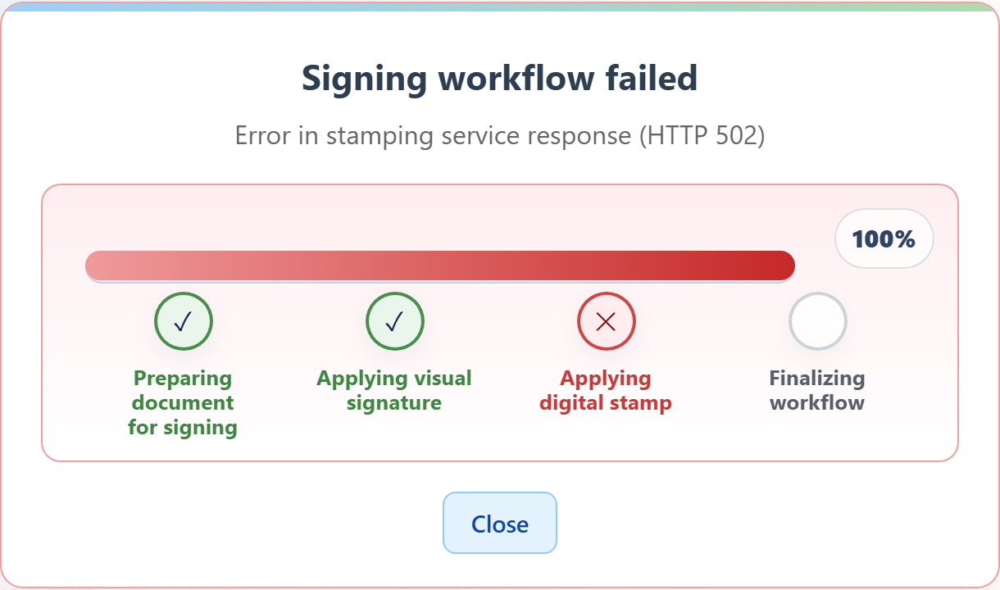

# It says signing failed — what does that mean?

## The document was not signed

Start here, because it is the thing people worry about: **a failure means nothing was signed.**

Each stage of signing produces a new version of the document rather than altering the previous
one. If a stage fails, the process stops and the earlier version is left intact. There is no
state where a document ends up half-signed, partly filed, or damaged.

So you have not accidentally agreed to anything, and there is no corrupted document sitting in
somebody's system.

## What you see

The progress panel turns red. The title changes to say the signing workflow failed, the step that
went wrong is marked with a cross, and a **Close** button appears.

The subtitle names which stage failed, sometimes with a code in brackets.

## What the messages mean

**"Signing failed! Please try again."** — the process stopped. The most general form of the
message.

**"Error in visual signature"** — the stage that places your drawn signature into the page did not
complete.

**"Error in stamping service response"** — the cryptographic sealing stage did not complete. This
often means a service the system depends on was temporarily unreachable.

A code in brackets is a technical detail for whoever supports the system. It is worth repeating to
staff because it tells them where to look.

## What to do

**1. Tap Close.**

**2. Tell the person at the desk**, and mention what the message said including any code.

**3. Try again if they ask you to.** Re-signing is safe — there is no risk of creating two signed
copies, because the first attempt produced no signed document at all.

## Why it might have happened

Usually something temporary: a service the system depends on was briefly unavailable, or a network
hiccup. These often clear on their own, which is why trying again frequently works.

If it fails repeatedly with the same message, something needs attention on the system side. That
is not something you can resolve from the pad — staff will need to escalate it.

## A note for staff

The failure is reported back automatically, so a system waiting on this document is told the
attempt failed rather than being left indefinitely expecting a signature. If failures are
recurring, the message and any code are the useful details to pass on.
