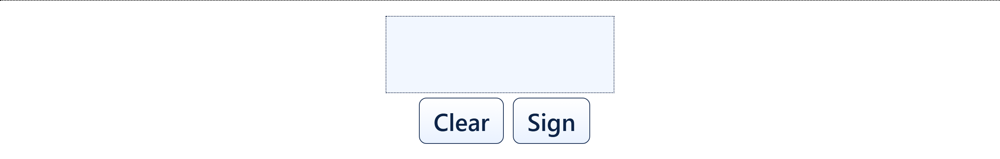
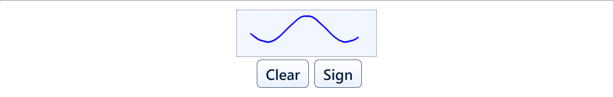

# Drawing and submitting your signature

Once you have read the document and filled in anything it asks for, the last step
is your signature.

## What you do

1. **Find the signature box.** It sits below the document, near the bottom of the
   screen, and stays in place while the document scrolls above it.
2. **Draw your signature inside the box.** Use a finger or a stylus. Sign the way
   you normally sign. The box accepts one continuous stroke or several separate
   ones, so a signature with a gap in it is fine.
3. **Not happy with it?** Tap **Clear**. The box empties and you can draw again, as
   many times as you like. Nothing is submitted until you tap Sign.
4. **Tap Sign.** This submits the document.

Drawn and ready to submit:

## The line above the box

Some setups show **Signer: <name>** just above the signature box. That name comes
from the system that sent the document, and it is there so you can check the
document is meant for you before signing.

If the name is wrong, **do not sign** — tell the person at the desk. If your setup
does not show this line at all, that is also normal; it is an option each
organisation turns on or off.

## After you tap Sign

The **Sign** button stops responding. This is deliberate, not a fault — it prevents
the same document being submitted twice while it is being processed. A progress
panel replaces the buttons and shows each step as it finishes.

If the box was empty when you tapped Sign, or a required field is still blank,
nothing is submitted. A message appears telling you what is missing. Fix it and tap
Sign again.

## What your drawn signature actually is

The mark you draw is placed into the document itself, so anyone opening the PDF
later sees it on the page.

Depending on how your organisation set PadSign up, a separate cryptographic seal
may then be applied to the whole file. Those are two different things: the drawing
is what people see, and the seal is what makes the file tamper-evident. The drawn
mark on its own is an image of a signature, not a cryptographic credential.

What is captured is the shape you drew. Nothing about how hard you pressed or how
fast you moved is part of the picture.

And if the result looks different from how you sign on paper — most people's tablet
signatures do — that is fine. The mark does not need to match your pen signature stroke for
stroke; it is your act of signing here, not a specimen to be compared against one.

## Questions this answers

- How do I sign the document?
- Where do I draw my signature?
- Can I redo my signature if it looks wrong?
- Can I use a stylus instead of my finger?
- Why is the Sign button not doing anything after I tapped it?
- Whose name is shown above the signature box?
- My signature looks different from my usual one - does that matter?

*Related terms: signature pad, draw signature, clear, redo signature, start again, sign button greyed out, nothing happens.*
