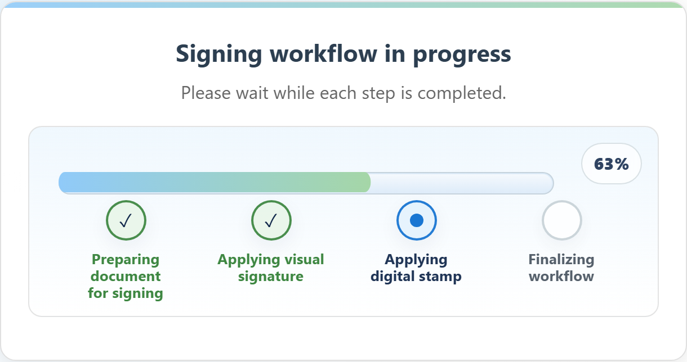

# Two different things happen when you sign

This is the single most useful thing to understand about a PadSign document,
because the two parts are easy to confuse and they do not do the same job.

## 1. The visual signature — what people see

The mark you draw with your finger or stylus is placed **into the page** of the PDF,
like an image pasted onto the paper. Anyone who opens the file later sees your
signature sitting there in the document.

That is its purpose: it makes the document look and read like a signed document. On
its own, it is a picture of a signature. A picture can be copied, so by itself it is
not what proves the document is genuine.

## 2. The cryptographic seal — what proves the file

Separately, a seal can be applied to the **whole file**. TrustLynx describes an
electronic seal as the digital equivalent of a company stamp: it provides evidence of
the document's origin and integrity, assuring recipients that a specific legal entity
issued the document and that it has not been tampered with since.

Two consequences worth being clear about:

- **It covers the entire document.** Any later change to the file — a word, a number,
  a page — is detectable. This is what "tamper-evident" means in practice.
- **It is issued to an organisation, not to you.** A seal uses a certificate belonging
  to a legal entity. So when a PDF reader shows who signed, it typically names the
  organisation, not the individual.

## How you see both happen

The progress panel shows them as separate steps: "Applying visual signature", then
"Applying digital stamp".

## The seal is optional

Not every deployment uses it. TrustLynx describes the e-seal function as optional,
for organisations with a compliance need for proof of authenticity and origin. Where
it is switched off, the progress panel shows three steps instead of four and the
document carries the visual signature only.

If it matters to you whether a particular document is sealed, ask the organisation
that produced it — it is their configuration choice, not a property of PadSign.

## Questions this answers

- What is the difference between the visual signature and the digital stamp?
- Is my drawn signature the legally binding part?
- What does the seal actually do?
- Why are there two signing steps?
- How do I know the document has not been altered?

*Related terms: e-seal, two steps, what is the seal, tamper evident, integrity, is the drawing enough.*

> **Important:** This explains how the mechanisms work, not what legal effect they have in your situation. Legal standing depends on the certificate and timestamp authority the operating organisation chose, and on the jurisdiction. Confirm with TrustLynx and your own legal advisers before relying on it.
