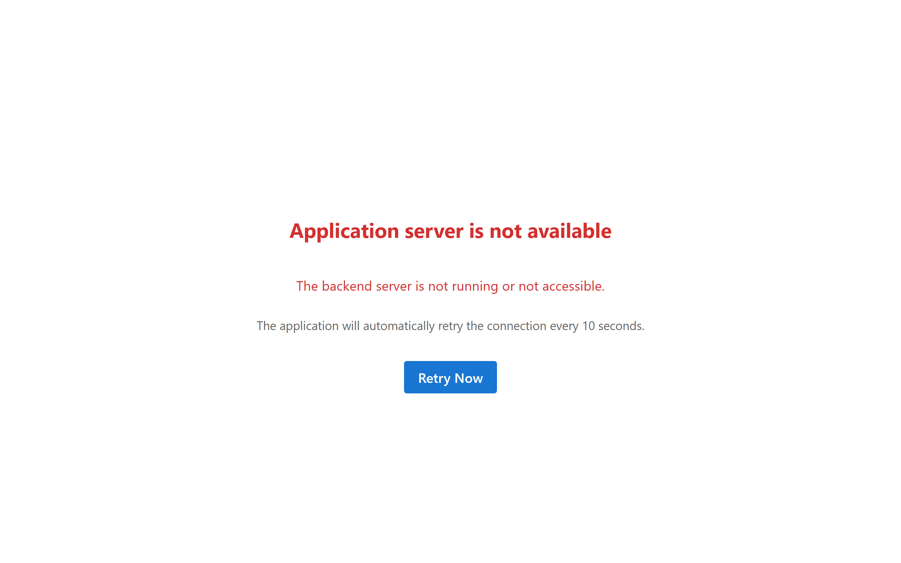

# "Application server is not available" and other access problems

## What the message looks like

The whole screen is replaced by:

> **Application server is not available**
> The backend server is not running or not accessible.
> The application will automatically retry the connection every 10 seconds.

with a **Retry Now** button.

## What it means

The pad cannot reach the system behind it. Either that system is not running, or something between
the device and it — network, wireless, proxy — is in the way.

The important thing is that the pad tells you clearly rather than appearing frozen or silently
failing. If you see this, you know exactly where you stand.

## What to do

**If you are the person signing:** tell the member of staff. This is not something you can fix
from the device, and there is nothing wrong with anything you did.

**If you are staff:** the pad retries every ten seconds on its own and recovers automatically when
the system comes back, so often the answer is to wait a moment. **Retry Now** just forces an
immediate attempt instead of waiting for the next cycle. If it persists, whoever runs the
deployment needs to look at it.

Worth checking quickly: does another pad show the same message? If all of them do, it is the system
or the network. If only one does, it is that device's connection.

## Is anything lost?

**No signed document is at risk.** Anything already signed and delivered is finished and stored —
it does not depend on the pad staying connected.

A document that was sitting **unsigned** on the pad will need sending again once the connection is
back. And if someone was part-way through filling in a form, that entry is lost and they will need
to start it again.

## If it shows a login screen instead

A pad should never present a login screen to a visitor. The device is signed in as the organisation
and stays that way.

If a login screen appears, the device's session has ended or been lost. Sessions do expire from
time to time — the device renews its own session silently in normal operation, but if renewal
fails (after a long period offline, for instance), the pad falls back to the login screen. A
visitor should not try to log in — they have no account and are not supposed to. Tell staff, who
can sign the device back in; it takes moments and nothing signed is affected.

## Related but different

Do not confuse this with the pad simply showing a **logo**. A logo means everything is working and
no document has been sent yet. This message means the connection itself is broken. The two need
completely different responses.

## Questions this answers

- It says "Application server is not available", what do I do?
- The pad cannot connect, how do I fix it?
- What does the Retry Now button do?
- Why is the tablet showing a login screen?
- Why did the pad suddenly ask to log in again?
- Is my signed document lost if the server is down?

*Related terms: server not available, offline, backend, access problem.*
