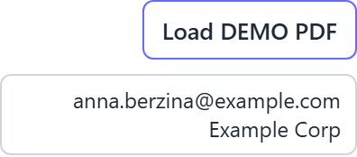

# Screen: The demo control cluster with a Load DEMO PDF button and the signed-in account shown beneath it

The demo control cluster, which sits in the top-right corner of the screen. Cropped here to show
it on its own.

At the top, an outlined button reading **Load DEMO PDF**. Tapping it opens the device's file
picker so any PDF on the device can be chosen; the file is then uploaded and appears on the pad as
though a system had sent it.

Below the button, a rounded box shows the account and organisation the device is signed in as — in
this capture a placeholder `anna.berzina@example.com` and `Example Corp`. That is the **device's**
account, not the signer's; nobody signing a document has an account.

This whole cluster only exists when demo mode is enabled, which is an evaluation setting. A pad in
production shows no upload button and no account box. If these appear on a device that is supposed
to be live, it is worth flagging — demo mode lets whoever holds the device upload arbitrary
documents.

## Questions this answers

- What is the Load DEMO PDF button in the corner?
- Whose email is shown in the top right corner?

*Related terms: demo button, demo mode, upload, evaluation, account shown.*
