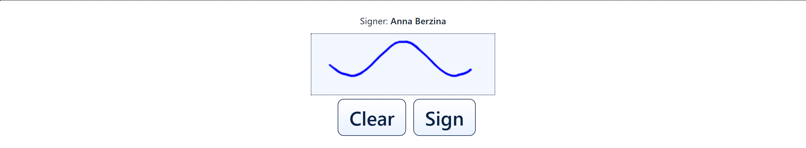

# Screen: The signature box with a Signer name label displayed above it

The signature area with the optional signer-name label switched on.

A single line of text sits directly above the signature box, reading **Signer:** followed by a
name in bold — in this capture a fictional "Anna Berzina". The name comes from the system that
sent the document, such as a customer record, and is there so the person can confirm the
document is meant for them **before** signing.

Below the label everything is as usual: the dotted-bordered signature box, with a signature
already drawn in it here, and the **Clear** and **Sign** buttons beneath.

This label is an option each organisation turns on or off, so its absence is normal too. Where
it is shown and the name is wrong, the correct response is not to sign and to tell the member of
staff — it means the document was generated from the wrong record.

## Questions this answers

- Whose name is above the signature box?
- What does the Signer line above the box mean?
- Why is a name shown before I sign?

*Related terms: signer name, name above signature, is this for me, wrong name, check identity.*
